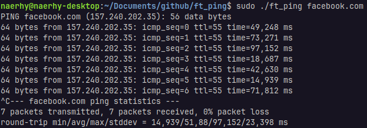
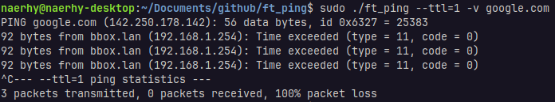

# ft_ping

Custom implementation of ping command.

## Description

This program is a custom implementation of the existing ping command (`man ping`). It's a good exercise to understand the functioning and architecture of the IP and ICMP protocols. In order to complete the project, we need to learn how IP packets are sent and what the IP and ICMP headers are made of.

ft_ping can be divided into several stages, it:
1. parses options and destination, and initializes the raw socket
2. sends ICMP echo message every x seconds to the specified destination
3. loops indefinitely to receive ICMP replies, then validates the packets (by checking IP and ICMP headers) and prints message's information
4. stops the loop when a `SIGINT` is raised
5. displays program statistics and releases allocated resources

As requested by the subject, the program only manages IPv4 addresses and hostnames.  
The usage of a raw socket requires the executable to be run with sudo privileges.

## Usage

```
# build the program
make

# run the program
sudo ./ft_ping [options] (destination)

# display help
./ft_ping -?
```

## Screenshots




